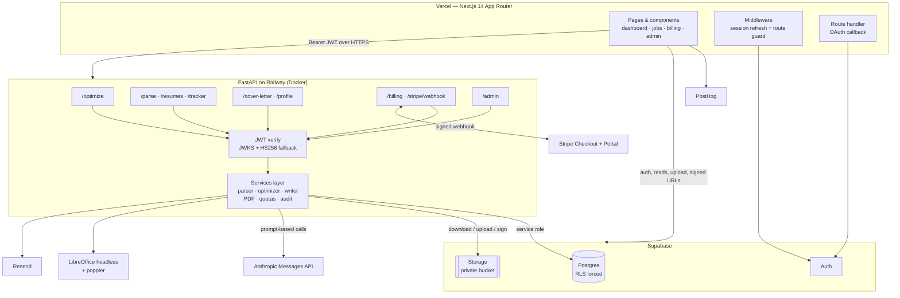

# Aptly — Architecture Case Study

**[aptlycareers.com](https://aptlycareers.com)** · AI resume tailoring that edits your real `.docx` in place: same fonts, same layout, same page count.

> Aptly is a live commercial product, so its source code is private. This repository documents how the system is designed and built, the engineering problems it solves, and the trade-offs behind them. I built it end to end as a solo founder: frontend, backend, database, infrastructure, billing and the AI pipeline.

## What it does

A user uploads their existing resume, pastes a job posting, and gets back **the same Word document** with its bullets and summary rewritten to match that posting.

Most AI resume tools generate a new document from extracted text, which destroys the user's formatting. Aptly's central constraint is the opposite: modify the original file surgically and leave everything it didn't rewrite untouched.

It also tracks the jobs a user has applied to and can draft cover letters on the Premium plan.

## Architecture



- **The browser talks to two services.** It goes to Supabase directly for auth, reads, uploads and signed URLs, and to the FastAPI backend for anything that needs a server secret or heavy document work.
- **Privileged keys stay on the backend.** The Anthropic key, Stripe secret and Supabase service-role key never reach the client.
- **Uploads never touch the API.** Files go straight to a private Storage bucket, under a path whose first segment is the owner's user id. The bucket policy enforces that.
- **The backend is one FastAPI app.** Eleven router modules sit over a services layer that does the real work.

## Tech Stack

| Layer | Technology |
|---|---|
| Frontend | Next.js 14 (App Router), React 18, TypeScript, Tailwind CSS, shadcn/ui (Radix) |
| Backend | Python 3.12, FastAPI, Pydantic v2, Uvicorn |
| Database & auth | Supabase Postgres with forced row-level security, Supabase Auth (email + Google OAuth), Supabase Storage |
| AI | Anthropic Messages API (Claude), prompt-based, with optional prompt caching |
| Documents | `python-docx`, LibreOffice headless, poppler |
| Payments | Stripe Checkout, Customer Portal, signed webhooks |
| Email / analytics | Resend (transactional), PostHog |
| Hosting | Vercel (frontend, per-branch previews), Railway (Docker backend) |
| Testing | pytest (241 tests), Vitest + Testing Library (37 tests) |

## The tailoring pipeline

```
upload .docx ─► ATS screen ─► parse + classify paragraphs ─► LLM rewrite (JSON)
     ─► backend validation of every edit ─► in-place write-back ─► page-count check
     ─► keyword verification ─► DOCX + PDF export via signed URLs
```

1. **ATS screen at upload.** Documents built from tables, text boxes or multi-column layouts are rejected before any AI spend. Those are the same layouts real applicant tracking systems parse badly.
2. **Parse and classify.** Every paragraph gets a deterministic id and is classified as protected or editable. The classifier is a pure function over feature dictionaries, kept separate from `python-docx` so it can be unit-tested without real files.
3. **Model call.** The model receives the job description plus each paragraph's id, whether it may be edited, its edit mode, and a character and line budget. It returns structured JSON.
4. **Validation.** The backend, not the model, decides what gets written (see below).
5. **Write-back.** Accepted edits are applied into the original file object, and the document is rendered to check the page count.

## Engineering highlights

### 1. Editing a Word document without breaking it

A resume's value is partly its formatting, so regenerating the document isn't acceptable.

- **Protected paragraphs:** names, contact lines, headings, job/company/date header lines, anything with a hyperlink, and the entire education and certifications sections.
- **Editable paragraphs** each get a **write strategy**:
  - `simple_full_paragraph`: uniform formatting, so the whole text can be replaced.
  - `inline_label_body`: a bold "Skills:" label followed by a body. Only the body is rewritten, and the label is never touched.
  - `mixed_bullet_safe`: mixed-run bullets that are normalized using the paragraph's *dominant* formatting, not whatever the first run happened to be.
  - `mixed_run_unsafe`: skipped entirely.
- **How write-back works:** it replaces the first run's text and empties the sibling runs. Character formatting, numbering, style and indentation all survive, so bullets stay bullets. Writing to a protected paragraph raises an error instead of proceeding silently.

*Trade-off:* correctness over coverage. Paragraphs that can't be classified with confidence are left alone.

### 2. Keeping a one-page resume on one page

A slightly longer rewrite silently reflows the document, and the failure only shows up after export.

- Each editable paragraph gets a character and line budget. It's derived from the real page width and margins, the paragraph's font, size and indent, and a calibrated characters-per-inch table for common resume fonts.
- By default, edits may not grow a paragraph at all. That rule came from testing: letting bullets fill their theoretical line capacity pushed one-page resumes onto a second page in Word, even when LibreOffice's page count missed it.
- Resumes that are already two or more pages get a controlled ~20% growth allowance.
- The final page count is verified by rendering to PDF. A run that gains a page fails instead of returning a resume that spilled over.

### 3. The model doesn't get the final say

The model is told not to invent employers, dates, degrees or metrics, but instructions aren't the safeguard. **The backend re-checks every edit independently** and drops any that:

- target a protected or unknown paragraph,
- use the wrong edit contract for that paragraph type,
- are empty,
- exceed the paragraph's character budget, or
- would add a visual line.

Because headers, dates, employers and education are **structurally unwritable**, the highest-cost fabrications (invented jobs, dates or degrees) can't reach the document no matter what the model returns.

Two post-generation checks treat the finished file as the only source of truth:

- **Keyword verification.** Every keyword the model claims to have added is re-searched in the final document with word-boundary matching. Anything missing is demoted from "added" to "gap", so the UI never shows a keyword the resume doesn't contain.
- **Write-back validation.** The original and generated files are hashed to prove they differ, and at least one applied edit must actually appear in the output.

If an edit only failed its length budget, it gets one smaller follow-up model call asking for a shorter version. If that call fails, the first result is kept.

### 4. Making Linux-rendered PDFs match Word

Calibri and Cambria don't exist on Linux. Without matching font metrics, LibreOffice substitutes wider fonts, text re-wraps, and the PDF gains a page the DOCX doesn't have.

- The Docker image installs **metric-compatible font families**: Carlito for Calibri, Caladea for Cambria, Liberation for Arial, Times and Courier. It adds broad Unicode and CJK coverage and reports font availability at startup.
- Conversions are serialized behind a lock, and each one is instrumented: duration, queue wait, page count and peak memory.

### 5. Defense-in-depth authorization

- **Forced row-level security on every user table.** Postgres silently ignores policies on tables where RLS isn't enabled, so a dedicated hardening migration explicitly puts every table into a known-good state.
- **Database triggers** enforce what policies can't:
  - no cross-user resume references,
  - tier-aware resume caps,
  - privileged profile fields can't be self-edited.
- **Python ownership checks** run before any service-role query, because the service role bypasses RLS.
- **Backend JWT verification** uses the project's JWKS, with key caching and a forced refresh when keys rotate.
- **Request models carry no `user_id` field**, so ownership can only come from the verified token.

### 6. Cost-aware AI usage

- Every model call records input and output tokens, plus cache-creation and cache-read tokens. A USD estimate goes into a per-job cost ledger visible in the admin dashboard.
- The static instruction block uses prompt caching. User content is never cached.
- Quotas are checked **before** expensive work starts. Failed runs and cache hits never consume quota.

## Testing

| Suite | Scope |
|---|---|
| **Backend, 241 tests (pytest)** | Parser safety and classification, mixed-run bullets, inline label edits, output validation, ATS checks, user data isolation, cross-ownership, usage limits, keyword audit, length constraints, page-count flags, billing, auth. Fixtures include real DOCX files. |
| **Frontend, 37 tests (Vitest)** | Middleware guards, auth flows, upload, comparison view, match details, optimize progress, tracker. |
| **Environments** | Separate production and staging Supabase projects, and protected Vercel preview deployments per branch. |

## Roadmap

- CI on every push (GitHub Actions running both test suites).
- Move the optimize pipeline to a background job queue. It currently runs synchronously in one request.
- Semantic truthfulness checks that compare each rewritten bullet with its original.
- Support for `.pdf` input.

## Links

- Live product: [aptlycareers.com](https://aptlycareers.com)
- Portfolio case study: *(coming soon)*
